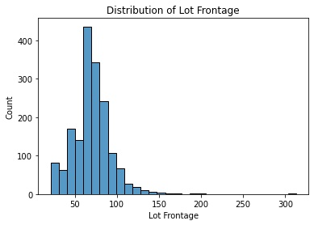
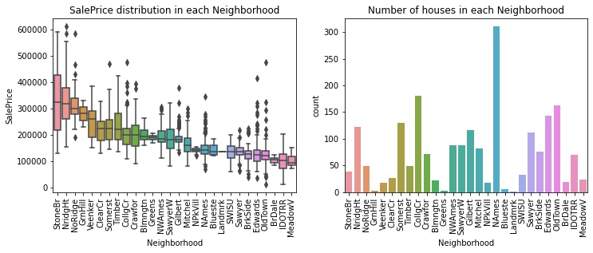
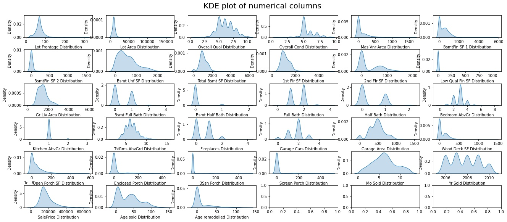
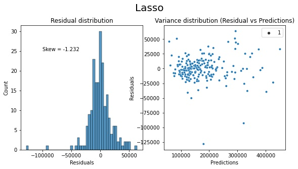
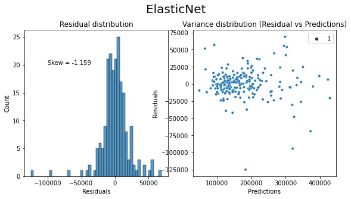
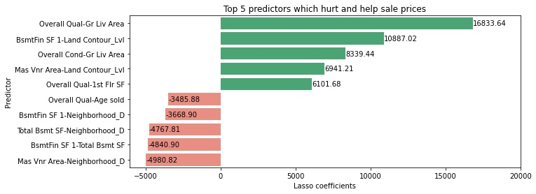

# Project 2: Ames Housing Data Predictions

# Problem Statement

To construct a linear regression model to predict housing prices in Ames, Iowa and in doing so, identify features which prices are most sensitive to. The accuracy of the model will be evaluated by both root mean squared error (RMSE) as well as coefficient of determination, R2.

# Contents:
- [Background](#Background)
- [Data Import & Cleaning](#Data-Import-&-Cleaning)
- [Exploratory Data Analysis](#Exploratory-Data-Analysis)
- [Model Preprocessing](#Model-Preprocessing)
- [Baseline Model Fitting](#Baseline-Model-Fitting)
- [Model Selection](#Model-Selection)
- [Output for Kaggle](#Output-for-Kaggle)
- [Conclusions](#Conclusions)
- [Recommendations](#Recommendations)

# Background
##### [Back to Contents](#Contents:)

Housing is a basic need of humanity. To some, it is simply a place to live. To others, its an instrument of investment, where handsome profits could be made. Common sense dictates that there are some universally agreed constructs that strongly correlates with house prices, such as distance to amenities or transport. However, these may not fully account for the true value of the house.

By distilling the relationship between sale prices and various features of a house, our model is able to identify which features are significant in influencing its value and guide homeowners in refurbishing their houses to fetch the most value. In addition, homeowners are also able to make a decent estimation of their house value given its features.

This codebook aims to predict housing prices in Ames, Iowa. Data was obtained from [Kaggle](https://www.kaggle.com/c/dsi-us-11-project-2-regression-challenge/data). It is worth noting that any model would be sensitive to time and context and hence unique to the locale. In other words, for the same geographical location, features which might be important at a given time period might not be same as those 2 decades ago, as demographics shift. Naturally, features which are important to a given locale might not necessarily be the same as those for another locale.

# Data Import & Cleaning
##### [Back to Contents](#Contents:)

The training dataset consists of 2051 rows and 81 columns. Given the small dataset, it is wise not to drop any more rows which might hurt our model's predictive power. The data dictionary can be found [here](http://jse.amstat.org/v19n3/decock/DataDocumentation.txt).

### Replacing null values

##### Lot Frontage

Given that the distribution is continuous, somewhat normally distributed with no relations to other columns, we will impute null values with the mean.

##### Mas Vnr, Bsmt, Garage

Columns related to Mas Vnr (Masonry Veneer), Bsmt (Basement) and Garage (Garage) are null simply because those features are not present in the house. For such features, categorical columns are replaced with a common string while numerical columns are imputed with 0.

##### Others

Other columns with null values have intended meaning, such as "No fence" and will be imputed as such.

### Feature Engineering

##### Categorical columns

For some categorical columns such as Neighborhood and MS SubClass, the large number of categories is undesirable for our model as it would result in extra features for our models which might result in overfitting. Furthermore, some of these categories have very low count and are unlikely to sway the model as much. Hence, we will limit the number of categories for each categorical column to at most 4.

Using Neighborhood as an example, we can see from the count plot that there are 4 distinct groups of neighborhoods when arranged in descending order of median SalePrice. We will use this as a basis for aggregating into 4 groups, and apply the same principle for other categorical columns.

##### Creating new columns

Instead of using the year of sale or remodelling, we will instead use the age of the house at the point of sale and remodelling.

##### Dropping columns

A total of 15 columns will be dropped, with the rationale as follows:

|Column to drop|Rationale|
|---|---|
|Id|Not related to SalePrice|
|PID|Not related to SalePrice|
|Year Built|Replaced with Age sold|
|Year Remod/Add|Replaced with Age remodelled|
|Garage Yr Blt|No meaningful way to impute if house does not have a garage|
|Pool Area|Vast majority of houses have no pool|
|Pool QC|Vast majority of houses have no pool|
|Sale Type|Not related to SalePrice|
|Utilities|Overwhelmingly 1 category|
|Condition 2|Overwhelmingly 1 category|
|Roof Matl|Overwhelmingly 1 category|
|Heating|Overwhelmingly 1 category|
|Misc Feature|Overwhelmingly 1 category|
|Misc Val|Overwhelmingly 1 category|
|3Ssn Porch|Overwhelmingly 1 value|

This can help reduce dimensionality and hopefully minimise overfitting.

# Exploratory Data Analysis
##### [Back to Contents](#Contents:)

The following numerical features have the strongest correlation with SalePrice:

|Feature|Pearson Correlation|
|---|---|
|SalePrice|1.000000
|Overall Qual|0.800207
|Gr Liv Area|0.697038
|Garage Area|0.650270
|Garage Cars|0.648220
|Total Bsmt SF|0.628925
|1st Flr SF|0.618486
|Year Built|0.571849
|Year Remod/Add|0.550370
|Full Bath|0.537969

While there are features which are correlated with each other which might cause multicollinearity, it might not be wise to drop them as they might still provide useful information for the model, since our objective is to create as accurate a predictive model as possible. Rather, we will create interaction terms with scikitlearn's `PolynomialFeatures` function and leverage on `Lasso` to suppress the majority of resulting features which are likely to be noise. Since we do not have sufficient domain knowledge to manually select features, we can only rely on the model to help us do so.

Inspecting the distribution of numerical columns, some of them look highly skewed, such as `Open Porch SF`. The target variable `SalePrice` also presents slight skewness. We will however not scale these features for now as the distribution of the features is unimportant. Rather, the distribution of the residuals post-modelling will inform us if further scaling is required.

# Model Preprocessing
##### [Back to Contents](#Contents:)

The following preprocessing steps were performed:
1. Create X and y variables containing the predictors and target columns respectively
2. Dummify all categorical columns using pandas' `get_dummies` function
3. Create interaction terms with `PolynomialFeatures`
4. Split into training and testing sets in 9:1 ratio
5. Scale the predictors with `StandardScaler`

The resulting tables are of the shapes:

|Set|Shape|
|---|---|
|X_train|(1845,5151)
|X_test|(206,5151)
|y_train|(1845,1)
|y_test|(206,1)

Model selection and hyperparameter tuning will be performed on the training set while the test set serves to evaluate the model on unseen data, since we do not have `SalePrice` for the provided `test.csv`.

# Baseline Model Fitting
##### [Back to Contents](#Contents:)

Two baseline models were first fitted onto the training set: Linear regression and mean SalePrice, with results as follow:

|Model|Train R2|Test R2|Train RMSE|Test RMSE|
|---|---|---|---|---|
|Linear Regression|0.9999993138158464|-2129649878509135.5|65.84879434972856|3540822591065.514|
|Mean SalePrice|0.0|-0.005953911936618761|79492.74343105893|76727.32591779814|

As we can see, the baseline models have performed terribly; the Linear Regression model has severely overfitted.

# Model Selection
##### [Back to Contents](#Contents:)

### Model performance and hyperparameter tuning

We will explore Ridge, Lasso and ElasticNet as an enhancement to the Linear Regression model, since these models are able to suppress coefficients resulting from overfitting and enhance the model's predictive power.

Fortunately, these methods already come with specialised hyperparameter tuning functions RidgeCV, LassoCV and ElasticNetCV, and we will take advantage of them to select the best model and tune hyperparameters concurrently.

To cover all grounds, we also tested an ensemble model where the predictions from the 3 models are averaged.

|Model|Best alpha|Best L1 ratio|Train R2|Test R2|Train RMSE|Test RMSE|
|---|---|---|---|---|---|---|
Ridge|2364|NA|0.95942|0.92596|16012|20877|
Lasso|497|NA|0.95688|0.92883|16505|20468|
ElasticNet|31|0.95|0.95511|0.92539|16842|20956
Ensemble|NA|NA|NA|NA|16156|20461

For all 3 models, we observed some overfitting where the test score is worse than the train score. However, the difference is remarkably small given that the we started with an extraordinarily large number of features. As a side note, we have also ran the same models on the same dataset without `PolynomialFeatures`, but the results are worse. The interaction terms also presented stronger correlation with the target variable.

The best model appears to be Lasso, possibly due to its ability to completely suppress 94% of the features, leaving only the truly important ones.

The ensemble model performs better than any of the individual models. However, we will only use it for Kaggle submissions as the ensemble model is not explainable in terms of the coefficients. We will rely on the Lasso model for deriving insights.

### Testing linearity assumptions

While the skew value indicates a considerate amount of right skewness, there appears to be no discernible pattern in the residuals. While not shown in this notebook, we have experimented with log transformations on the numerical columns, which resulted in even worse residual patterns. Hence we can accept that the linear assumption of the model is satisfied.

# Output for Kaggle
##### [Back to Contents](#Contents:)

This score corresponds to the Lasso model and ranks 36/89 for the private leaderboard and rank 20/89 for the public leaderboard.

This score corresponds to the ensemble model. As we can see, stacking the models significantly improves the private score.

# Conclusions
##### [Back to Contents](#Contents:)

- While some variables have strong correlation with price (eg. Overall Qual), none of them alone is good enough to contribute to the model significantly. Rather, combinations of features are better as predicting features.
    
- Based on the top 5 features, we see that Overall Cond and Gr Living Area appear more than once.
    
- SalePrice is most sensitive to the feature "Overall Qual-Gr Liv Area". Each unit increase in this feature results in an increase of $16,883 of SalePrice.

- Based on the bottom 5 features, we see that Neighborhood D appears quite a few times, indicating that this cluster of neighborhoods (SWISU, Sawyer, BrkSide, Edwards, OldTown, BrDale, IDOTRR and MeadowV) is not doing well in terms of price appreciation. These neighborhoods could attract lower housing prices due to older houses (such as OldTown) or perhaps some local demographic properties of that neighborhood.

- Neighborhood is not significant in influencing housing prices as other factors.

- The term "Mas Vnr Area-Neighborhood_D" hurts house prices the most. Each unit increase depresses the price by $4,981. This is imaginable as older houses tend to fetch less value than newer houses.
    
- This model is unlikely to be generalizable to other cities. In this model, we used all 5000 factors to determine housing prices because we did not have enough domain knowledge to perform manual feature selection. In reality, two populations may not share the same "taste" for desirable features in a house.
    
- To make the model more generalizable, it would be better to cut down on the number of variables and use only general features, such as distance to a transport system. This would of course come at an expense of the predictive power of the model.

- Though we see that certain features appear in predictors that help and hurt house prices, judging by the significance of the impact, these features still overall improve house prices. For example, Masonry Veneer Area appears in both sets of predictors that hurt/help prices, but the extent is larger in the predictor that help house prices. Moreover, the model suggests that the impact is only negative if, concurrently, the house is also situated in Neighborhood D. In other words, if the house was in another neighborhood, the impact may not be negative.    

# Recommendations
##### [Back to Contents](#Contents:)
    
Our model suggests to optimise two features simultaneously for the best results. For homeowners,

- Improve on Overall Condition, Overall Quality, 1st Floor Area  and Ground Living Area, since these are continuous variables.
- Expand Basement Finished Area only if the house is situated on flat land (Land Contour)
- Expand Masonry Veneer Area only if the house is situated on flat land (Land Contour)
- If the house is in neighborhood D, reduce the areas of Basement Finished, Total Basement and Masonry Veneer
- Minimise the Basement areas
- Sell the house while it is still young

For homebuyers,
    
- Buy houses with good Overall Condition, Overall Quality, and large 1st Floor Area  and Ground Living Area
- If the house is situated on flat land, buy houses with small or no Basement Finished Area and Masonry Veneer Area, so that you can increase these aspects later on
- If the house is in neighborhood D, avoid those with Basement Finished, Total Basement and Masonry Veneer Areas
- Buy houses with small or no Basement areas
- Buy houses which are young, since prices deteriorate with age    

### Possible Enhancements

Other avenues we can explore to improve our predictions include:
- Trial other predictive models (eg. RandomForest, Support Vector Machine)
- Obtain more data
- Obtain more general features of the house such as crime rate, ethnicity, distance to amenities or facilities