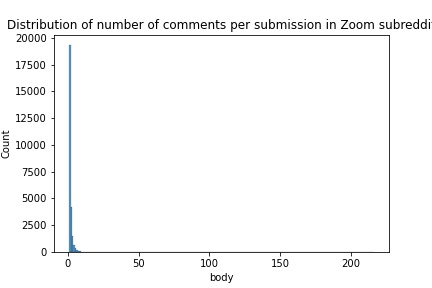
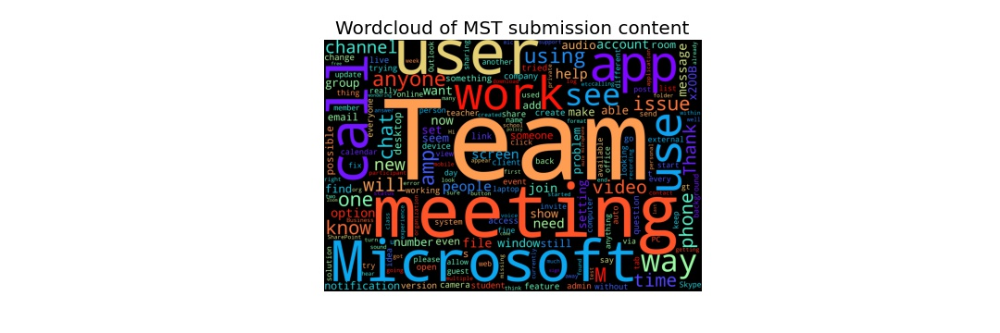
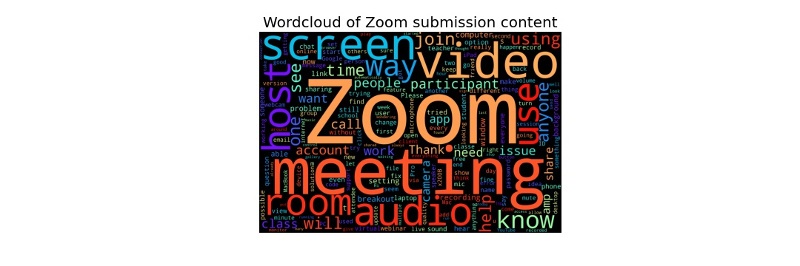
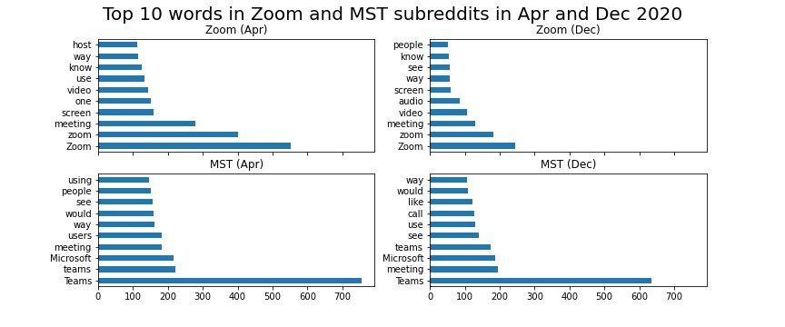
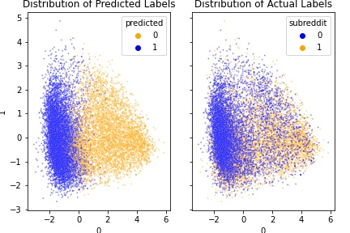
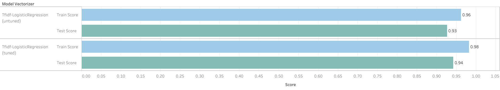
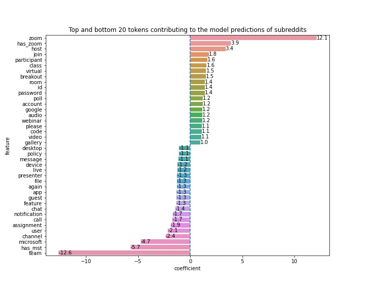
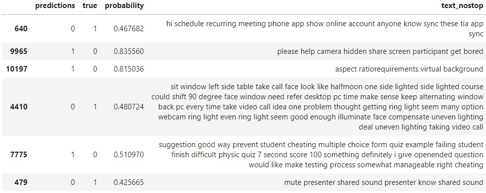

# Project 3: Classification of Reddit Posts

# Problem Statement

As part of the data analytics team in Zoom, we have been tasked with analysing discussions on Zoom and Microsoft Teams (MST) sub-Reddits. We will employ Natural Language Processing (NLP) techniques and train a machine learning model in a supervised fashion to classify submissions belonging to either sub-Reddits. As the model will use the content of the Reddit posts to perform classification, we can then use the insights derived from the model to determine the content that is correlated with Zoom and MST. From there, we will make two-pronged recommendations - to the software development team (SDT) and the marketing team (MT):

- For the SDT, we will highlight common issues faced by users as well as any wishlist features that our users would like to see.
- For the MT, we will examine features that MST users have issues with (more than Zoom users) and recommend to tweak the advertising strategy to capitalise on their perceived weaknesses. Secondly, we will also recommend to use words closely associated with Zoom and MST to be considered for our Search Engine Marketing and Search Engine Optimisation campaigns. Lastly, we can also utilise these words as paid keywords such as Google AdWords or organic keywords in our sites.

Success of the model will be evaluated via simple accuracy score, by calculating the proportion of predictions it got correct. Accuracy is sufficient for our problem as we will sample an equal number of posts from both sub-Reddits. Furthermore, both classes are equally important (ie. wrongly predicting the Zoom sub-Reddit is equally bad as wrongly predicting the MST sub-Reddit). A secondary layer of success evaluation would be the model's confidence - how confident it is at making predictions. In other words, we want to be sure that the model is not simply guessing the labels by chance. Otherwise, this may result in volatile results when performing on unseen data.

# Background

MST is our largest and fastest growing competitor in the videoconferencing industry. In a world terrorized by COVID-19, companies worldwide scramble to put together business continuity plans which enabled employees to continue working and operations to continue functioning in the midst of movement restrictions.

Reddit is a network of communities where people can dive into their interests, hobbies and passions. There currently exists a sub-Reddit for Zoom (27k members) and another for MST (37k members). People can talk about literally anything under the sun, though in teh context of our chosen sub-Reddits, the content is usually centred around seeking advice for technical issues.

In this project, we will explore the following NLP techniques:

- TFIDFVectorizer
- Word2Vec
- BERT

The following supervised learning models will also be tested for their ability to classify the Reddit posts:

- RandomForestClassifier
- LogisticRegression
- MultiLayer Perceptron Classifier

# Data Collection

[Pushshift's Reddit API](https://github.com/pushshift/api) was used to scrape text data from [Zoom](https://reddit.com/r/Zoom) and [MST](https://reddit.com/r/MicrosoftTeams) sub-Reddits. As interest in virtual conferencing platforms only exploded in 2020, we scraped all submissions and comments from 1 Jan 2020 onwards, with the intention to subsequently narrow down the time period for analysis after exploring the data.

The API collects a sizeable amount of information for each submission/comment, however we will only use a few for our analysis, since the main goal is to analyse the text data, rather than the metadata.

Columns for submissions:

|Column|Rationale|
|---|---|
|created_utc|Datetime of submission|
|id|Unique id for each submission, used to join comment data|
|selftext|Description and actual content of submission. This will be concatenated with the title column to avoid loss of information, since a user can post the actual content in either the selftext or title part. For example, one user may post "Help needed" as the title and the actual question in the selftext while another user may plonk the entire question in the title.|
|title|Title of submission|
|subreddit|Name of subreddit, also target variable for our classifier|

Columns for comments:

|Column|Rationale|
|---|---|
|created_utc|Datetime of submission|
|parent_id|Unique id for the submission where the comment was made under|
|body|Content of the comment|
|subreddit|Name of subreddit, also target variable for our classifier|

# Data Cleaning and EDA

Based on the time series plot, we observe the following:

- There are many more comments than submissions (obviously)
- Content on both subreddits spiked from Apr 2020, which corresponds to the period where most countries go into high alert/lockdowns and interactions were shifted online
- MST content was sustained throughout the 2 years while Zoom content dwindled over time after the initial spike

For the purpose of analysis, we will limit the timeframe to 1 year starting from 1 Apr 2020, the period during which most relevant Reddit content would have been generated.

As there were more Zoom submissions than MST, we randomly undersampled rows from the Zoom dataset to ensure that classes are equal. We thus ended up with about 7000 submissions for each subreddit.

### Basic text cleaning

As we intend to experiment on different methods of word vectorization, we will perform further cleaning later on, specific to the method. Here, we:

- Removed "[deleted]" and "[removed]" placeholders.
- Replaced new line placeholders (\n) with blank space. This is so that words are not unnecessarily concatenated to each other.
- Removed URLs as these do not provide any useful information.
- Removed comments whose author is 'AutoModerator' as the content provides no value.
- Drop rows whose text content are null, blank string or empty.
- One-hot encoded MicrosoftTeams as 0 and Zoom as 1.

No text cleaning was also performed on the comments as we do not intend to use its text. Rather, we will generate aggregated statistics on the comments as additional features to be fed into the machine learning model, to reduce the complexity of our model.

### EDA

We see that most submissions have no comments. In fact, the average number of comments is 1.6. This is true for both subreddits.

Other than the product name, a cursory scan of both wordclouds indicate that some of the terminologies used are very similar, such as "meeting", "use". Some distinction in words include:

- Host (Zoom)
- Screen (Zoom)
- App (MST)
- Call (MST)

Because the product name is so prominent, we can take advantage of these to summarise comments for each submission, rather than incorporating the text itself. Our text analytics will thus only focus on content from the submission.

### Aggregating comment statistics

For each comment, we will calculate the following statistics:

|Column|Description|
|---|---|
|has_zoom|Whether the word "zoom" occurs (without "microsoft" or "teams")|
|has_mst|Whether the words "microsoft" or "teams" occur (without "zoom")|
|has_zoom_mst|Whether the comment has both "zoom" and either "microsoft" or "teams"|
|no_zoom_mst|Whether the comment has neither "zoom" nor "microsoft" nor "teams"|    
|char_count|Number of characters of comment|   

With these statistics, we will further aggregate to the submission level. Each submission will thus have the following statistics:

|Column|Description|
|---|---|
|prop_zoom|Proportion of comments that only have "zoom"|    
|prop_mst|Proportion of comments that only have "microsoft" or "teams"|    
|prop_zoom_mst|Proportion of comments that have "zoom" and either "microsoft" or "teams"|    
|prop_no_zoom_mst|Proportion of comments that has neither "zoom" nor "microsoft" nor "teams"|       
|avg_cmt_len|Average length of comments|     
|num_cmts|Number of comments|  

We see that for MST (0), on average, 32% of the comments for each submission contains MST tags only, while 66% of the comments do not mention either Zoom or MST. For Zoom, on average, 24% of the comments for each submission contains Zoom tags only, while 76% of the comments do not mention either Zoom or MST. The average comment length is also higher for MST as compared to Zoom.

In other words, we can postulate that given a particular submission, if a higher proportion of its comments are geared toward a certain tag, it is more likely that the submission is from that subreddit. This is of course, a no-brainer, but we can see that 'has_zoom' and 'has_mst' might be potentially useful features in our machine learning model. We will proceed to drop the other 3 features since they do not show obvious distinctions between the 2 subreddits.

## Has the discussion content changed over time?

From a cursory scan of the top 10 words for each subreddit in Apr and Dec 2020, there does not appear to be a major change in content for both.

# Preprocessing & Modeling

In order for machine learning to be applied to text, the text needs to be first converted into numbers, a process known as vectorisation. There are many different ways of vectorisation ranging in terms of complexity.
    
In this project, we will explore 3 different vectorisation methods and see which produces the best results. These are:
-  TfidfVectorizer    
-  Word2Vec
-  BERT 
    
We will also test 2 different machine learning models to see which is able to best distinguish the subreddit contents. These are:
-  LogisticRegression
-  RandomForest
-  MultiLayer Perceptron Classifier    
    
Because of the differences in how the 3 word vectorizers vectorisers the text, we need to perform further text cleaning in different ways, such as deciding whether to remove stopwords and/or lemmatize the text. When performing text analytics, it is important to ensure that words of similar meanings are grouped together to avoid duplication, as in the case of 'run', 'ran', 'running'. Two popular methods are Porter Stemmer and Lemmatization. Both methods attempt to return a given word to its root word, or lemma, but does so in a different way. It is also worth noting that neither are able to correct spelling errors. This might throw our model off if such errors occur in large quantities.

Porter Stemmer is a rule-based method that removes word prefixes and suffixes in a pre-determined fashion. It is fast, although the resulting word may not be an english word. For example, stemming 'computer' results in 'comput'. It is also rather blunt, as stemming 'computation' also results in 'comput', although both words might have different meanings. Lemmatization on the other hand, is a softer approach and takes the context of the word into account. However, it is computationally more expensive. As we want our model to be as accurate and interpretable as possible, we will go with lemmatization instead where appropriate.
    
**TfidfVectorizer** is an improvement over the standard CountVectorizer, where the occurrence of a word in the document is compared to its occurrences over the whole corpus. For example, if the word 'computer' occurs frequently in Zoom submissions but doesn't occur again elsewhere, we can say that 'computer' is likely to be very important to that sub-reddit. On the other hand, words like 'that' are generic and probably occur in every document, hence less weightage will be assigned to this word. The mathematical formula to calculate Tfidf is such that the resulting value might be a decimal, and the resulting dataframe has the same number of rows as the number of submissions, and the number of columns equal to the number of unique words. As such, the following preprocessing will need to be applied when using TfidfVectorizer:
-  Removal of punctuation, special characters and stopwords: These add no value to the overall meaning of the document. While the formula of Tfidf would already neglect these items naturally, it would be good to remove them anyway.
-  Lemmatization: Since the vectorizer does not take into account the meaning of the word, we'll need to group similar words together via Lemmatization to avoid duplication of words of similar meanings.     
-  Casing: Word casings should be standardized to lower case to avoid duplication of words with similar meanings (eg. run vs RUN)   
    
**Word2Vec** is a more advanced technique at deciphering word meanings and seeks to decompose every word into an n-dimensional array, such that words of similar meaning would be close together in n-dimensional space. Sentences can then be aggregated by taking the average of the arrays of the individual words. It employs a "bag-of-words" model, which means that two sentences which are in complete reverse in order would also end up with the same aggregated vector, which sounds odd. However, in practice, this method still works relatively well despite this theoretical drawback. The process of assigning vectors to each word is done by using a pre-trained model [(link)](https://github.com/RaRe-Technologies/gensim-data) which has trained on a Google news dataset containing 100 billion words. Since the language is the same (English) and the use of language is not significantly different from the Google news dataset, using the pre-trained model would save us hundreds of hours of training time without sacrifice in accuracy. A disadvantage of Word2Vec is that unusual words and spelling errors cannot be recognised and have to be manually removed prior to vectorisation. It is also unaware of the context, such as 'bank' as in a financial bank vs a river bank. The aforementioned pre-trained model decomposes words into 300-D arrays and as such, our resulting dataframe would have the same number of rows as the number of submissions, and 300 columns. We will apply the following preprocessing method for Word2Vec:
-  Removal of punctuation, special characters and stopwords: As these do not add meaning to the sentence, having them would dilute the overall meaning of the sentence. Hence we should remove these.
-  Lemmatization: Words such as 'run' and 'ran', though similar, will have slightly different vectors which may contribute to the overall meaning of the sentence. For this project, we will not lemmatize the text to retain its original meaning.
-  Casing: This is abit of a double-edged sword where casing can both help and hurt in determining the overall meaning of the sentence. For example, in this model, 'zoom' and 'Zoom' are recognised differently, with the model being able to pick up the fact that the latter is the videoconferencing platform. Standardising casing would lose this distinction. On the other hand, typo errors such as 'zooM' would cause the model to be completely unable to recognise the word and force us to discard it. For this project, we will retain the original casing as it is more important that the true meaning is captured.
    
**BERT** is an even more advanced method to vectorize text. BERT is able to take the entire sentence, stopwords and punctuation together and figure out its context of every single word. Hence, the 'bank' in financial banks and river banks would have different vector arrays. For this project, we will use DistilBert, a small, fast, cheap and light Transformer model trained by distilling BERT base. It has 40% less parameters than bert-base-uncased, runs 60% faster while preserving over 95% of BERT’s performances. We will also use the pre-trained model 'distilbert-base-uncased' to save us training time, as we did for Word2Vec. The output of DistilBert is an M x N x 768-dimension array, where M is the number of docments and N is the number of tokens. We will be using the inbuilt [CLS] token as the document average vector (other methods involve averaging the word vectors as in Word2Vec, or taking the weighted average by Tfidf). Because BERT is context-dependent, we will not perform any further preprocessing for this, to avoid confusing the model.    

||TfidfVectorizer|Word2Vec|BERT|
|---|---|---|---|
|Removal of punctuation, special characters and stopwords|Y|Y|N|
|Lemmatization|Y|N|N|
|Standardised casing|Y|N|N|

### Visualising Word2Vec word vectors with PCA

It is difficult for us to visualise a vector space of 300 dimensions to get a sense of how "close" words are, but we can employ Principle Component Analysis (PCA) to decompose the 300 dimensions into the 2 principle components such that we can view it in 2-d space. PCA is a linear dimensionality reduction technique that strives to preserve as much information as possible within a fewer number of dimensions. It is useful for feature reduction and visualising high dimension data, but the downside is that the resulting features are no longer interpretable. There is also no need to scale the data as Word2Vec already puts the vectors in the same scale.

We have chosen the top 10 words from the earlier word count (manual) in Zoom and MST subreddits to see if these words can be distinguish properly and hence provide some clue as to how successful our model may be.

Well how about that! We can see that the distinction between the words from Zoom subreddit and words from MST subreddit are quite nicely divided, with the exception of "app" and "im". This is indeed a promising sign that the content between the 2 subreddits are distinct enough to be picked up by our models.

### Exploring BERT word vectors with Agglomerative Clustering

After converting our submission text into vectors, we are now ready to feed the numbers into our machine learning models. Before that, we could explore our vectorized text further to see if it is likely to give us a good split.

One such method is Agglomerative Clusting (AC), an unsupervised learning technique used to find clusters within data. A major advantage of this model is that it does not require the user to pre-define the number of clusters unlike in KMeans Clustering, though the AC model is computationally expensive on larger datasets. Although we do have labelled data here, AC can give us a sense as to whether the word vectors will be useful in segmenting submissions from different subreddits.

The following steps are done in AC [(reference link)](https://stackabuse.com/hierarchical-clustering-with-python-and-scikit-learn/)

- At the start, treat each data point as one cluster. Therefore, the number of clusters at the start will be K, while K is an integer representing the number of data points.
- Form a cluster by joining the two closest data points resulting in K-1 clusters.
- Form more clusters by joining the two closest clusters resulting in K-2 clusters.
- Repeat the above three steps until one big cluster is formed.
- Once single cluster is formed, dendrograms are used to divide into multiple clusters depending upon the problem.
Once the dendrogram is complete, the number of clusters can be selected by the user. If there is no logical way to estimate the number of clusters, a common way is to locate the largest vertical difference between nodes, and in the middle pass a horizontal line. The number of vertical line crossed would then result in the number of clusters.

The AC plot can be used to estimate the level of distinction between the 2 subreddits. From the above plot, we see that the blue line is the largest vertical difference, which indicates that there are 2 major clusters. However, we do not know for sure whether these 2 clusters correspond to MST or Zoom. Nevertheless, the plot is useful in telling us that there are 2 distinct clusters. In fact, there could even be sub-clusters.

From the above chart, we can see that the separation from AC, although it is able to find 2 clusters, the labels may not necessarily line with the original labels (0 = MST, 1 = Zoom). Based on the distribution pattern though, we can be fairly certain that the model has inverted the labels, since it has no intuition on the original labels. Therefore, we will adjust the color to get a better sense, where class 1 in the AC is class 0 in the original (MST).

While the AC model has found 2 decent clusters, we see that the original data is alot messier and overlaps much more, which is unsurprising. We can use the AC model to also determine some kind of accuracy score.

Because we have to invert the model classes, we can see that the accuracy is 26%+36% = 62%. This is not a very good score compared to our baseline (see below).

### Visualising Word2Vec and BERT word vectors with t-SNE

One problem text analytics is that it's usually difficult if not impossible to visualise the spread of the data, since the text has been vectorized into so many dimensions (768 for BERT).

t-Distributed Stochastic Neighbor Embedding (t-SNE) is an unsupervised, non-linear technique that is capable of dimensionality reduction and hence be able to visualise high dimension data. t-SNE shines over the traditional PCA method as PCA is a linear technique and is hence unable to capture non-linear patterns well, especially in high dimension space (reference). Since our vectorized text data is non-linear, t-SNE would be more appropriate as a dimensionality reduction tool.

That said, a drawback of t-SNE is that unlike PCA, it is not able to "learn" from the data and be used subsequently on unseen data. Hence, we will use t-SNE only for visualisation of text vectors output from BERT and Word2Vec.

From the above chart, we can see that the data is not very well distinguished in 2D space, although there are several noticeable clusters. If this distribution is representative of the actual distribution in multi-dimensional space, then linear classifiers such as Logistic Regression is expected to not perform well if the text is vectorized with BERT.

The separation is visibly better when using Word2Vec to vectorize our text, as seen from a clear left half dominated by Zoom and right half dominated by MST. In this case, linear classifiers might do okay, since the boundaries can be defined with a line.

### Modeling (Baseline)

The baseline model for this project would be a random classifier, which would predict either class with 50% probability. Thus, the accuracy score for this baseline model would be 50%. Our models should therefore strive to achieve a score significantly better than 50%.

Alternatively, a better model would be to check if Zoom or MST tags are present in the string and classify them as that. In this model, submissions which have both tags would be classified under both. Doing so gives us an already pretty good accuracy of 87% using MST tags.

We shall see if our machine learning models can do better than this.

### Modeling (Model Selection)

At the initial phase, we tested a total of 9 combinations arising from 3 vectorizers:

- TfidfVectorizer
- Word2Vec
- BERT    
    
and 3 models:
    
- LogisticRegression
- MultiLayer Perceptron Classifier
- RandomForest
    
All models were untuned, using default hyperparameters, including the TfidfVectorizer and the results were:
    
  

We obtained a pretty decent result right off the bat, with scores of 80% or better. The TfidfVectorizer-LogisticRegression combination seemed to work best (93%) and has accuracy 6 pct points higher than the baseline. 

For tfvec, the best model is LogisicRegression, which is also the best out of all. For w2v, the best model is MLP while for bert, the best model is again LogisticRegression.

Despite its simplicity, LogisticRegression does pretty well. This could be because due to the large number of features, our MLP and RF models overfitted to the data, as seen where the training score is significantly higher than the test score for these 2 models.

However, as the difference in performances is small, tuning the models might result in a different outcome. However, from a practical perspective since there were so many combinations of vectorizers, models and hyperparameters to test, we used the RandomizedSearchCV which randomly selects n combinations within the specified space.
    
    
 
The results were not comparable to the first graph as cross_val_score was used instead, to avoid data leakage from the hold-out test set. However, it is clear that the TfidfVectorizer-LogisticRegression combination still edges out the rest.

Amongst the vectorizers, Tfidf performs the best. This could possibly be due to the nature of the text where, if we were to vectorise the text according to its meaning and context, both subreddits would give similar results due to the fact that the product is similar to start with. For example, on both subreddits, there would be alot of discussions relating to the features of the product, many of which exist in both. In other text classification problems such as the classic ham vs spam, there is no clear key words that strongly identifies ham or spam, hence models such as BERT, which takes into the account the context of the whole sentence, might do better. Furthermore, BERT and Word2Vec were trained on texts with proper English, and applying them to Reddits, where language is often mashed up, may cause them to not do very well. Hence, Tfidf, which simply counts and weights individual words, might work better for this problem. Nevertheless, the results are still outstanding, at around 80-90%.

LogisticRegression, despite being the simplest model, consistently outperforms the rest. One reason could be due to the large number of dimensions compared to the number of samples, which is more suited for high-bias low-variance models such as LogisticRegression. Other models might suffer from overfitting, as we saw earlier.

With this knowledge, we proceed to further tune this combination, including the the hyperparameters of TfidfVectorizer. We also included the comment statistics as additional features for the model, as prepared earlier.
    
 
    
With the tuning and added features from comments, we managed to improve accuracy by about 1%.   

We also computed prediction probabilities from our model and found that on average, it is 88% when predicting MST subreddits and 84% when predicting Zoom subreddits. While there is no good benchmark as to whether our confidence score is good or not, we can at least say that the model is more or less robust and confident in its predictions. In other words, it is not "lucky" by chance because it predicts a particular label which happens to be correct, even though it is only 50.1% confident.

### Understanding our final model

We observe that the vast number of words have little to no impact on the model's predictions, which is expected. However, we do see a slight left skew, indicating that there are more words indicative of MST as compared to Zoom.

The coefficients of LogisticRegression measure the degree which the target variable is sensitive to the feature. A larger absolute value of the coefficients implies that the target is more sensitive toward that feature.

From the above graph, we see that the word "zoom" has the largest coefficient while "team" has the largest negative coefficient. In order to derive meaningful interpretations, one has to first take the exponent of the coefficient. For the word "zoom", that value would be about 4,000,000. In other words, having the presence of this word increases the ratio of success to failure by 4 million times. In the context of our problem, success is defined by classifying the submission as a Zoom subreddit, and is arbitrarily set. Ie. Success could also be defined as MicrosoftTeams and the result would be the same. The graph here was not exponentiated to show the relative comparison of the features; doing so would cause the other features' coefficients to be negligible given that the feature "zoom" is already 4 million.

Because of the exponent, we say that features with a coefficient larger than 0 will improve the odds of the model predicting Zoom, and features with coefficients less than 0 will improve the odds of the model predicting MST. The blue dotted line depicts this cut off. Interestingly, out of the 16000 features, only 7000 of them, when present, increases the odds of success.

The coefficients imply that the 2 words "team" and "zoom" are extremely important; this is unsurprising. Of interest is also the "has_zoom" and "has_mst" features which are essentially summary statistics of the comments. If a larger proportion of comments mention zoom or MST only, then that submission is likely to belong to that category.

### Exploring the context where specific words are used

*gallery*

The discussion on gallery refers to desires for improved functionalities surrounding gallery views. 

*breakout*

The discussion on breakout seem to be centred around functionality of breakout rooms.

*notification*

The discussion on notification seems to centre around users voicing their frustrations on notification settings.

### Exploring misclassifications

Row 640: There aren't really any keywords here from either subreddit, hence although the prediction was MST, the model's confidence is only 46%.

Row 9965: Here, the model is very confident that it is from a Zoom reddit, probably due to the word "participant". However, this is a general word that one can easily use it in either context, hence we can see why the model misclassifies, in the absence of other words.

Row 10197: Similarly, to row 9965, the model picks up on the word "virtual" and confidently (and wrongly) predicts Zoom, though virtual backgrounds are a feature common to both.

Row 4410, 7775 and 479: There is quite a large chunk of text here but there are no really strong keywords, hence the model can only make a somewhat random guess.

As we can see, there are limitations to the TfidfVectorizer where once it has identified a word to be strongly correlated with a certain class, it will tend to predict submissions with that word as that class, if no other strong keywords are present. This causes some degree of misclassification, but we are still pleased with the overall accuracy of 94%.

BERT, on the other hand, might be able to do better in such circumstances due to its ability to interpret the entire context as opposed to picking up only specific keywords. However, due to the nature of reddit posts where language is often disregarded, it might be difficult for BERT to pick up "internet lingo", as it was trained on texts with proper English.

# Conclusions & Recommendations

We have successfully trained a LogisticRegression model to predict a post's subreddit with 94% accuracy by first vectorizing the text using TfidfVectorizer.

Using the model's coefficients, we identified top words that would result in the model predicting either class. Some of these words are generic and provide no further information (eg. team, zoom), while others may provide some insight as to what the general population thinks. We have also performed deeper dives into these words to have a better sense on why users are talking about it. Based on top submissions for the keywords, we have developed recommendations for the SDT and MT.

**Recommendations for SDT:

- [On breakout rooms] Allowing host to create breakout rooms via mobile devices eg. iPad
- [On breakout rooms] Allowing reassignment of participants to breakout rooms without first closing the rooms
- [On breakout rooms] Allowing host to pre-assign multiple rounds of breakout rooms
- [On gallery view] More functionalities around gallery view eg. sharing gallery view with participants, ordering of gallery frames, filling empty spaces within gallery view, allow gallery view when session is recorded
- Given that notifications are a major pain point for MST users, ensure that the notifications settings in the Zoom interface is as intuitive and comprehensive as possible.

Improving our platform features will provide a more pleasant and seamless experience for users and win more users over to our side. This will lead to an increase in our revenue when more companies subscribe to our usage plans.

**Recommendations for MT**:

- Use the top 20 words closely associated with Zoom (eg. host, join, participant, class, virtual) in our Search Engine Marketing and Search Engine Optimisation campaigns.
- Utilise these words as paid keywords such as Google AdWords or organic keywords in our sites.

By knowing the "lingo" that our users employ when discussing about our product, we can provide more targeted help to users when they use this "lingo" to search for our product. Buying out Google AdWords can also direct more users to our platform and expand our marketing reach.

# Future Work

In terms of future work, we would like to explore the following areas:

- Updating the dataset with more recent submissions to see if there are differences in content. Since our dataset is 1 year ago, updates, patches and new features would have been introduced by both platforms.
- Further training the BERT model with our dataset to update its ability to recognize "Reddit" lingo, which may differ from the standard English it has been pre-trained on.